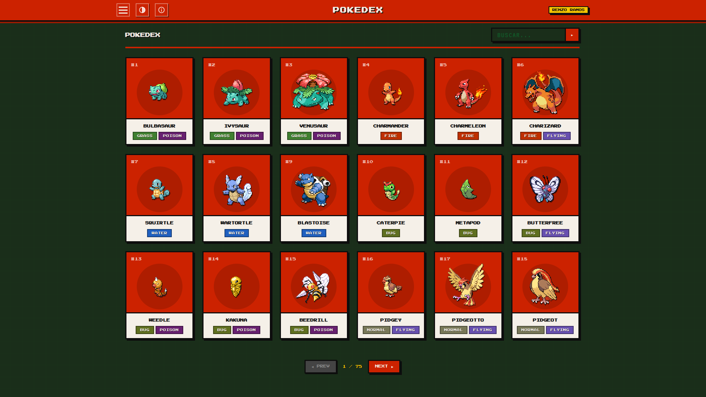
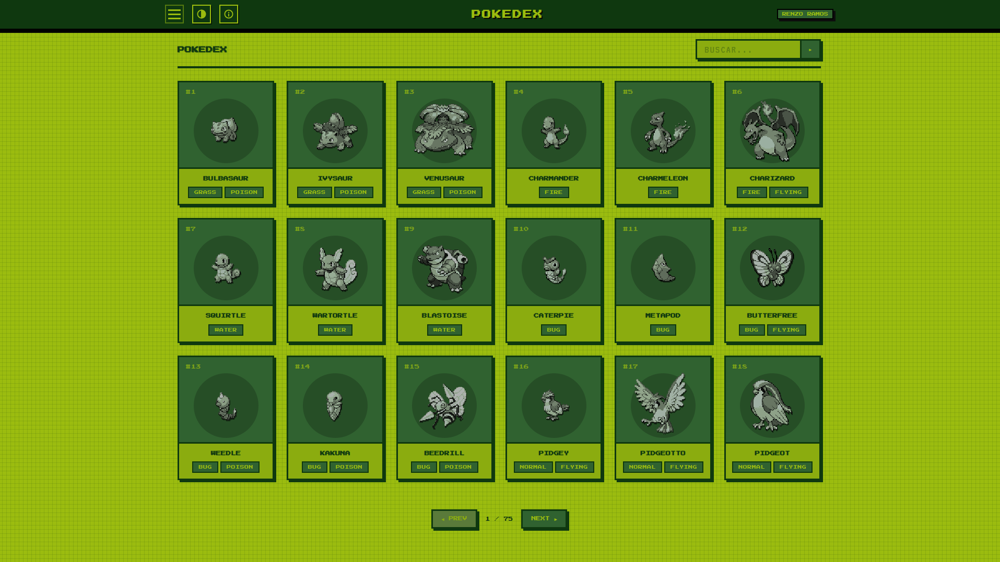
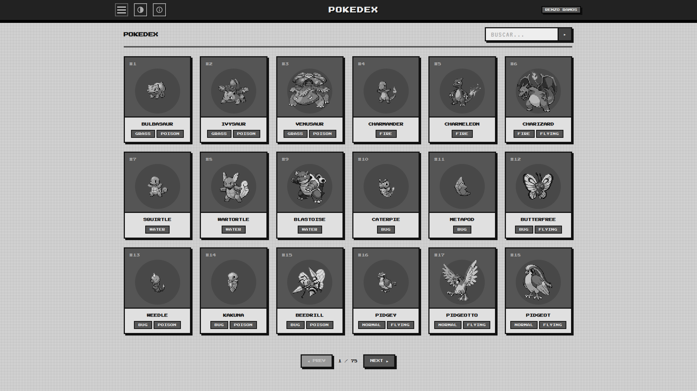
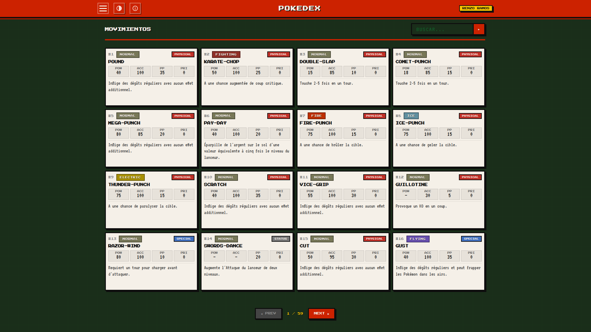
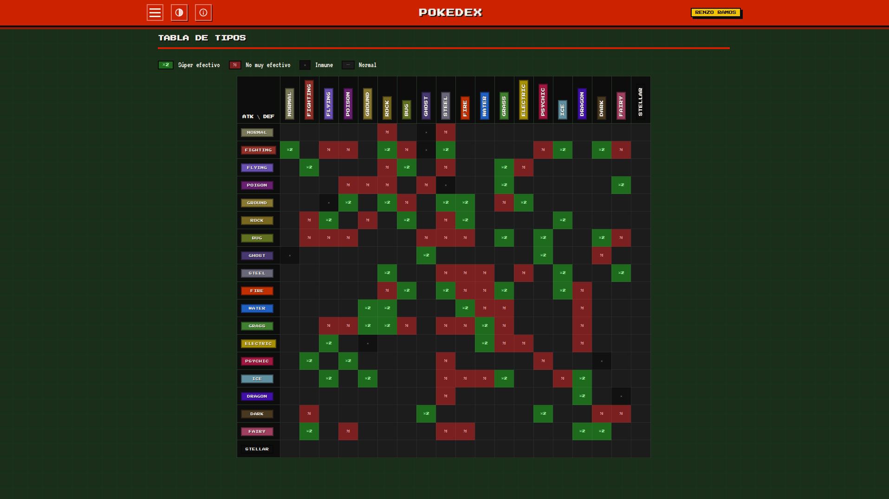
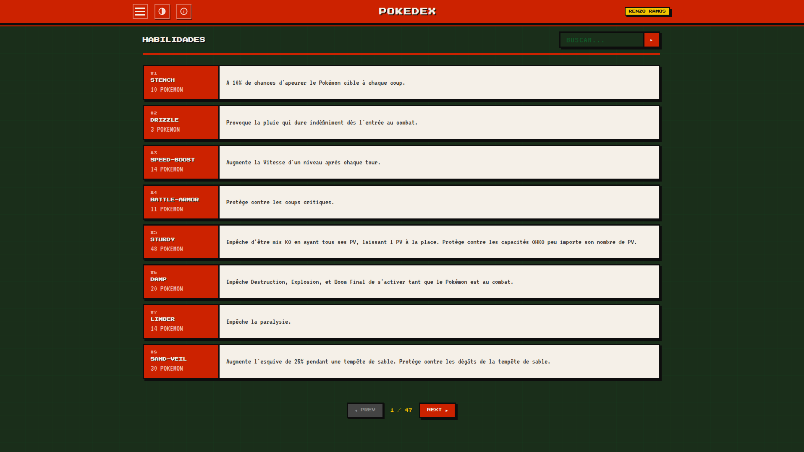
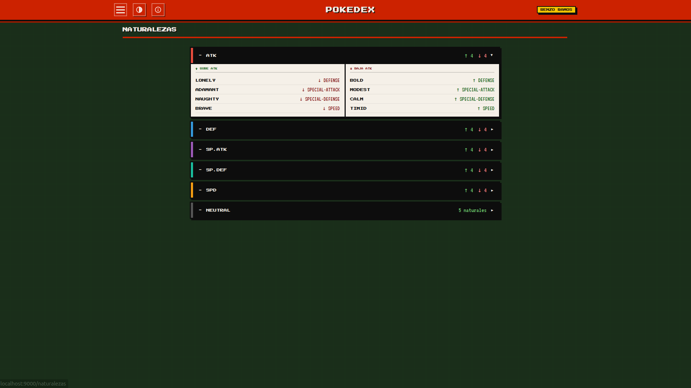
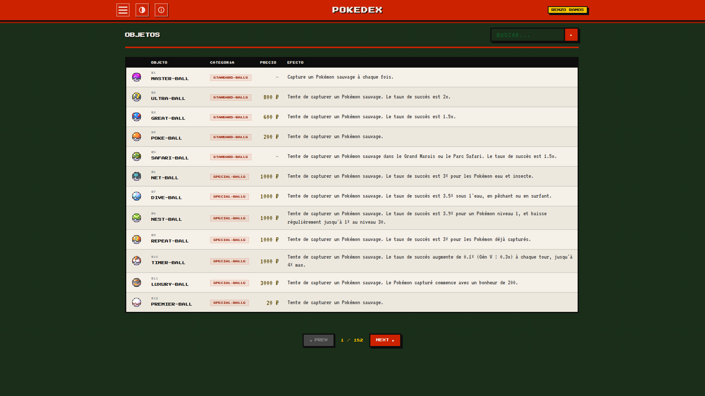
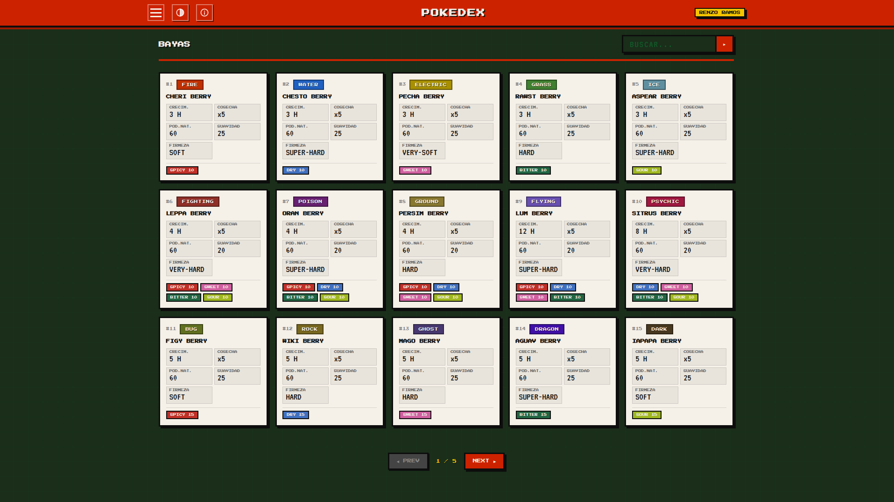

# Pokédex Retro + Chatbot ReAct (MCP)

Proyecto Pokémon de extremo a extremo con estética retro de los 90. Empezó como
una **Pokédex web** en Scala/Play que consume [PokéAPI](https://pokeapi.co) en
tiempo real, y ha crecido hasta incluir una **API REST JSON**, un **servidor
MCP** y un **chatbot de IA** (patrón ReAct) que responde preguntas en lenguaje
natural sobre Pokémon.

Todo vive en un único repositorio, en cuatro capas que se apoyan unas en otras:

```
┌────────────────────┐   ┌────────────────────┐
│  Pokédex web HTML  │   │  Chatbot ReAct web │   ← lo que ve el usuario
│  (Twirl + CSS)     │   │  (FastAPI + JS)    │
└─────────┬──────────┘   └─────────┬──────────┘
          │                        │ OpenAI (tool-calling)
          │                        ▼
          │              ┌────────────────────┐
          │              │  Cliente MCP        │
          │              └─────────┬──────────┘
          │                        │ MCP (stdio)
          │                        ▼
          │              ┌────────────────────┐
          │              │  Servidor MCP       │  mcp_server/server.py
          │              └─────────┬──────────┘
          │                        │ HTTP
          ▼                        ▼
   ┌───────────────────────────────────────────┐
   │        App Scala / Play (controllers)       │
   │   vistas HTML  +  API REST JSON /api/*      │
   └─────────────────────┬─────────────────────┘
                         │ HTTP
                         ▼
                  ┌──────────────┐
                  │   PokéAPI v2  │
                  └──────────────┘
```

---

## Las cuatro capas

### 1. Pokédex web (Scala / Play)

Interfaz HTML con estética de consola clásica (Game Boy DMG-01 + juegos de 1ª gen).

- **7 secciones**: Pokédex, Movimientos, Tipos, Habilidades, Naturalezas, Objetos y Bayas.
- **Buscador** en cada sección con filtrado server-side.
- **3 temas visuales**: NORMAL (rojo retro), DMG (verde Game Boy), MONO (gris).
- **Paginación** configurable por sección.
- **Modal de detalle** por Pokémon con stats, tipos, habilidades y barras de progreso.
- **Tabla de efectividad de tipos** completa e interactiva.
- **Acordeón de naturalezas** agrupado por stat afectado.
- Navegación principal **sin JavaScript** (menú hamburguesa con CSS puro).
- Pixel art con fuentes **Press Start 2P** y **VT323**.

### 2. API REST JSON (`/api/*`)

Los mismos datos que las vistas, pero en JSON limpio para consumo por programas.
Cada controlador expone una acción `apiIndex` junto a su vista. Devuelve un array
JSON filtrado por `q` (búsqueda por substring, normalizada a guiones).

```bash
curl 'http://localhost:9000/api/pokemon?q=pikachu'
curl 'http://localhost:9000/api/tipos?q=fire'
```

Referencia completa: **[docs/API.md](docs/API.md)**.

### 3. Servidor MCP (`mcp_server/`)

Servidor [MCP](https://modelcontextprotocol.io) (FastMCP, transporte stdio) que
envuelve los endpoints `/api/*` y los expone como **7 herramientas** que cualquier
cliente MCP puede usar (el chatbot de este repo, Claude Desktop, etc.).

Detalle: **[mcp_server/README.md](mcp_server/README.md)**.

### 4. Chatbot ReAct web (`chatbot/`)

Chatbot en Python que responde preguntas en lenguaje natural sobre Pokémon usando
el patrón **ReAct** (Reasoning + Acting) con tool-calling de OpenAI. Actúa como
**cliente MCP**: pide el catálogo de herramientas al servidor MCP y razona en
varios pasos (Thought → Act → Observation → Answer).

- Interfaz **web** minimalista con la misma estética retro (temas NORMAL/DMG/MONO,
  cuadrícula de fondo, sprites tintados según el tema).
- **Flujo ReAct en vivo** vía streaming SSE, plegable.
- **Historial persistente** (sobrevive al refresco).
- Restringido al dominio Pokémon y resistente a intentos de jailbreak.
- Agnóstico al dominio: para que hable con otro proyecto, basta añadir su servidor
  MCP a la configuración.

Guía: **[chatbot/README.md](chatbot/README.md)** · Documento maestro de la
integración: **[docs/IMPLEMENTACION-REACT-MCP.md](docs/IMPLEMENTACION-REACT-MCP.md)**.

---

## Stack técnico

| Capa | Tecnología |
|------|-----------|
| Lenguaje backend | Scala 3.4.3 |
| Framework web | Play Framework 3.0.6 |
| Plantillas | Twirl (`.scala.html`) |
| HTTP client | Play WS (WSClient) |
| JSON | spray-json 1.3.6 |
| Build tool | SBT 1.10.11 |
| Fuente de datos | [PokéAPI v2](https://pokeapi.co/api/v2/) |
| Estilos | CSS puro (sin frameworks) |
| Chatbot | Python 3.10+, FastAPI, OpenAI SDK, MCP SDK |

---

## Cómo ejecutarlo

### Requisitos

- JDK 17+ y SBT (para el backend).
- Python 3.10+ (para el chatbot, opcional).
- Una `OPENAI_API_KEY` (solo si usas el chatbot).

### Backend + Pokédex web

```bash
git clone https://github.com/RenzoRamosDEV/Api-Pokemon-Scala-Web-IA-MCP.git
cd Api-Pokemon-Scala-Web-IA-MCP
sbt run
```

Disponible en **http://localhost:9000** (web HTML y API `/api/*`).

### Chatbot web (opcional)

Con el backend ya corriendo, en otra terminal:

```bash
cd chatbot
uv venv .venv && uv pip install -r requirements.txt   # o python -m venv + pip
cp .env.example .env                                  # y rellena OPENAI_API_KEY
python app.py
```

Disponible en **http://localhost:8080**. Arranca el servidor MCP por su cuenta.

---

## Variables de entorno

| Variable | Capa | Descripción | Por defecto |
|----------|------|-------------|-------------|
| `APPLICATION_SECRET` | Backend | Clave secreta de Play | `changeme-in-production-use-env-var` |
| `POKEAPI_BASE_URL` | Backend | URL base de PokéAPI | `https://pokeapi.co` |
| `OPENAI_API_KEY` | Chatbot | Clave de API de OpenAI | — |

---

## Estructura del proyecto

```
app/
├── controllers/              # Un controlador por sección (index HTML + apiIndex JSON)
│   ├── PokedexController.scala · MovesController.scala · TypesController.scala
│   ├── AbilitiesController.scala · NaturesController.scala
│   └── ItemsController.scala · BerriesController.scala
├── models/
│   ├── PokemonModels.scala       # Case classes + formats spray-json (read PokéAPI / write JSON)
│   └── GameModels.scala          # Resto de entidades + helper englishShortEffect
└── views/                        # Plantillas Twirl (main, index, _card, _modal, …)
conf/
├── routes                        # Rutas HTML + rutas /api/*
└── application.conf
public/stylesheets/pokedex.css    # Estilos + temas DMG y MONO
mcp_server/                       # Servidor MCP que envuelve la API REST
└── server.py
chatbot/                          # Chatbot ReAct (cliente MCP + web)
├── app.py                        #   servidor web FastAPI (streaming SSE)
├── static/index.html             #   interfaz de chat retro
├── react_agent/agent.py          #   bucle ReAct
├── mcp_client/manager.py         #   cliente MCP (lanza servidores, enruta tools)
└── mcp_servers.json              #   servidores MCP a conectar
docs/
├── API.md                        # Referencia de la API REST
└── IMPLEMENTACION-REACT-MCP.md   # Documento maestro de la integración IA
```

---

## Paginación por sección (web)

| Sección | Elementos por página |
|---------|---------------------|
| Pokédex | 18 (3 × 6) |
| Movimientos | 16 (4 × 4) |
| Habilidades | 8 |
| Objetos | 12 |
| Bayas | 15 (3 × 5) |
| Tipos / Naturalezas | Sin paginación |

> La API REST no pagina: filtra por `q` y limita a 60 resultados en las entidades grandes.

---

## Temas visuales

| Tema | Descripción |
|------|-------------|
| NORMAL | Rojo Pokédex clásico sobre fondo verde oscuro |
| DMG | Paleta monocromática verde LCD de la Game Boy original |
| MONO | Escala de grises inspirada en la Game Boy Pocket |

Disponibles tanto en la Pokédex web como en el chatbot (con persistencia y sprites
tintados según el tema).

---

## Capturas de pantalla

### Pokédex principal


### Temas visuales
| DMG (Game Boy verde) | MONO (escala de grises) |
|---|---|
|  |  |

### Movimientos


### Tabla de tipos


### Habilidades


### Naturalezas


### Objetos


### Bayas


---

## Autor

**Renzo Ramos** — [GitHub](https://github.com/RenzoRamosDEV)
